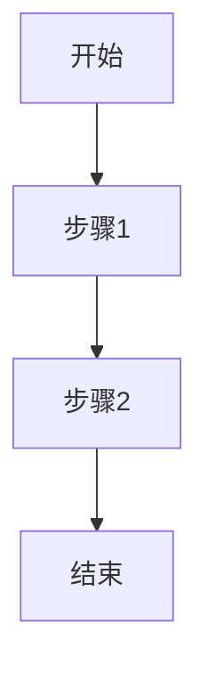

# Markdown文档创建规范

## 概述

本指南提供了在知识图谱系统中创建Markdown文档的标准和最佳实践。遵循这些规范可以确保文档的一致性、可读性和与知识图谱系统的无缝集成。这些规范适用于图谱文档、节点文档以及各种类型的专业文档（如API文档、变更记录等）。

## 文档格式要求

所有Markdown文档必须遵循以下基本要求：

1. **编码**: 使用UTF-8编码
2. **语法**: 使用标准Markdown语法
3. **标题**: 文档必须包含至少一个一级标题作为文档主标题
4. **换行**: 段落之间使用空行分隔
5. **缩进**: 列表项使用2或4个空格缩进（保持一致）

## 文档结构

### 基本布局

#### 图谱文档结构

```markdown
# [图谱名称] - [图谱类型]

## 概述

[图谱描述]

## 基本信息

- 创建时间: [创建时间]
- 更新时间: [更新时间]
- 节点数量: [节点数量]
- 关系数量: [关系数量]

## [主要内容部分]

[根据图谱类型填写相应内容]
```

#### 节点文档结构

```markdown
# [节点名称]

## 概述

[节点描述]

## 详细信息

- 类型: [节点类型]
- 创建时间: [创建时间]
- 更新时间: [更新时间]

## [节点特定部分]

[根据节点类型填写相应内容]
```

### 图谱类型特定内容

根据不同图谱类型，文档应包含特定内容：

#### 拓扑结构图谱 (Topology)

```markdown
## 组件结构

[描述系统的主要组件和模块]

## 依赖关系

[描述组件之间的依赖关系]

## 技术栈

[列出使用的技术、框架和库]

## 设计原则

[描述系统设计遵循的关键原则]
```

#### 时间线图谱 (Timeline)

```markdown
## 关键事件

### [事件1日期]
[事件1描述]

### [事件2日期]
[事件2描述]

## 决策记录

### [决策1]
- 日期: [决策日期]
- 参与者: [决策参与者]
- 背景: [决策背景]
- 结论: [决策结论]

## 里程碑

- [里程碑1]: [日期] - [描述]
- [里程碑2]: [日期] - [描述]
```

#### 变更日志图谱 (Changelog)

```markdown
## 变更记录

### 版本 [版本号] ([发布日期])

#### 新增功能
- [功能1描述]
- [功能2描述]

#### 改进
- [改进1描述]
- [改进2描述]

#### 修复
- [修复1描述]
- [修复2描述]
```

#### 需求文档图谱 (Requirement)

```markdown
## 功能需求

### [功能模块1]
- [需求1.1]
- [需求1.2]

### [功能模块2]
- [需求2.1]
- [需求2.2]

## 非功能需求

### 性能要求
- [性能要求1]
- [性能要求2]

### 安全要求
- [安全要求1]
- [安全要求2]

## 验收标准

- [标准1]
- [标准2]
```

### 节点类型特定内容

根据不同节点类型，文档应包含特定内容：

#### 组件节点 (Component)

```markdown
## API参考

### 属性
| 属性名  | 类型   | 默认值   | 描述   |
| ------- | ------ | -------- | ------ |
| [属性1] | [类型] | [默认值] | [描述] |
| [属性2] | [类型] | [默认值] | [描述] |

### 方法
| 方法名  | 参数   | 返回值   | 描述   |
| ------- | ------ | -------- | ------ |
| [方法1] | [参数] | [返回值] | [描述] |
| [方法2] | [参数] | [返回值] | [描述] |

## 使用示例

```typescript
// 代码示例
```

## 依赖关系

- 依赖于: [组件1], [组件2]
- 被依赖: [组件3], [组件4]
```

#### 变更节点 (Change)

```markdown
## 变更概述

[简要描述变更内容和原因]

## 影响范围

- [影响1]
- [影响2]

## 实现细节

[详细描述实现方式和技术细节]

## 测试结果

- [测试1]: [结果]
- [测试2]: [结果]
```

#### 需求节点 (Requirement)

```markdown
## 用户故事

作为[角色]，我希望[功能]，以便[收益]。

## 验收标准

- [ ] [标准1]
- [ ] [标准2]
- [ ] [标准3]

## 设计草图

[设计描述或图片链接]

## 依赖关系

- 依赖于需求: [需求1], [需求2]
- 关联功能点: [功能1], [功能2]
```

## 占位符处理

文档模板中的占位符（如`{{name}}`、`{{description}}`等）应替换为实际数据。主要占位符包括：

- `{{name}}` - 图谱或节点名称
- `{{description}}` - 图谱或节点描述
- `{{type}}` - 图谱或节点类型
- `{{createdAt}}` - 创建时间
- `{{updatedAt}}` - 更新时间
- `{{nodesCount}}` - 节点数量（图谱适用）
- `{{edgesCount}}` - 关系数量（图谱适用）

## Markdown语法参考

### 代码块

代码块应指定语言以获得语法高亮：

````markdown
```typescript
function example(): void {
  console.log('示例代码');
}
```
````

### 表格

表格应包含标题行和对齐符号：

```markdown
| 列1   | 列2   | 列3   |
| ----- | ----- | ----- |
| 数据1 | 数据2 | 数据3 |
```

对齐方式：
- 左对齐：`|:---|`
- 居中：`|:---:|`
- 右对齐：`|---:|`

### 图片

图片应包含替代文本和标题：

```markdown

```

### 链接

链接应使用描述性文本：

```markdown
[链接描述](URL "标题")
```

### 列表

有序列表：
```markdown
1. 第一项
2. 第二项
   1. 子项1
   2. 子项2
```

无序列表：
```markdown
- 项目1
- 项目2
  - 子项1
  - 子项2
```

任务列表：
```markdown
- [ ] 未完成任务
- [x] 已完成任务
```

## 特殊图表

### Mermaid图表

对于需要在Markdown中展示图表，推荐使用Mermaid语法：

````markdown

````

常用图表类型：
- `graph`：流程图
- `sequenceDiagram`：时序图
- `classDiagram`：类图
- `gantt`：甘特图
- `pie`：饼图

## 文件命名和存储

- Markdown文件将保存在`resources/md/`目录中
- 文件命名格式: `[标题转小写下划线]_[时间戳].md`
- 时间戳格式：毫秒级Unix时间戳(例如：`1625482990000`)
- 示例：`api_documentation_1625482990000.md`

## 常见问题和最佳实践

1. **保持简洁**：每个文档应关注单一主题，避免过长
2. **使用标题层次**：正确使用标题层级(h1-h6)，避免跳级
3. **图片和资源**：对于图片等资源，确保使用相对路径
4. **保持一致性**：在整个文档中保持术语和格式的一致性
5. **避免复杂格式**：如果不必要，避免使用HTML和复杂表格
6. **合理分段**：保持段落简短，一个段落表达一个观点
7. **及时更新**：当相关内容变更时，确保文档同步更新

## 总结

遵循本指南中的规范和最佳实践，可以创建高质量、一致且易于维护的Markdown文档，这些文档将无缝集成到知识图谱系统中，并提供清晰的知识传递体验。良好的文档不仅是知识的记录，也是知识共享和团队协作的基础。 